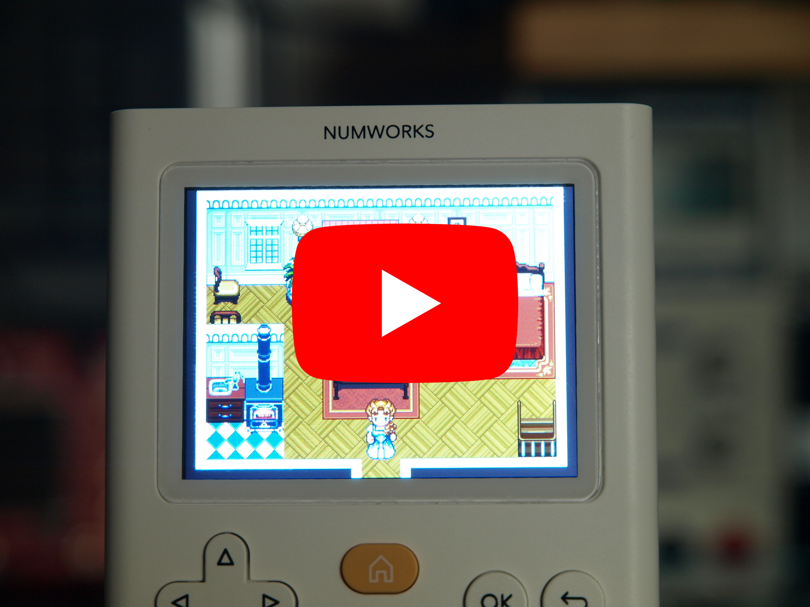
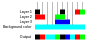

# GESTE
GEneric Sprite and Tile Engine

GESTE is a sprite and tile 2D render engine designed to run on
micro-controllers low performance systems. GESTE also provides a basic math and
physic engine using fixed point arithmetic.

## Creating maps

GESTE is developed in parallel with
[tiled-code-gen](https://github.com/Fabien-Chouteau/tiled-code-gen),
a tool that generates code from the
[Tiled Map Editor](https://www.mapeditor.org/).

## Examples

In this repository you can find three examples of games using `GESTE`. All the
examples are made with `Tiled map editor` and `tiled-code-gen`.

Here is the list of examples:

 - [platformer](examples/platformer)
 - [RPG](examples/RPG)
 - [racing](examples/racing)

You can build and try the examples using [GNAT
Community](https://www.adacore.com/download) (only tested on Linux so far).

## Design

### Layers

In GESTE, a scene is made of layers. Native layers can be `Sprite`, `Grid` or
`Text`. You can implement you own type of layers if you want to.

 - `Sprite` layers display a single tile at a given position
 - `Grid` layers display a grid of tiles at a given position
 - `Text` layers display a text at a given position

Layers have a priority which tells in which order they will be drawn on the
screen.

### Rendering

The rendering algorithm is somewhat similar to ray casting. Instead of taking
each objects of the scene and drawing it on the screen, the engine takes each
pixel and tries to find its color from the different objects of the scene.

For each pixel of the area that is being drawn, GESTE will go through the list
of layers and see if the corresponding pixel inside the layer is transparent or
not. When a non transparent pixel is found, the pixel is pushed to the screen
and the procedure starts again for the next pixel. If all the layers have a
transparent pixel, the background color is used.

The more layers to go through, the more time time it will take to render a
pixel.

### Rendering API

There are three rendering functions in GESTE.

#### Render_Window

`Render_Window` renders all the pixels of a given rectangle window. See above
for the rendering algorithm.

#### Render_Dirty

`Render_Dirty` only renders the pixels that changed since the last render.

Depending on the performance of CPU, the time it takes to update pixels on the
screen or the complexity of the scene, it can take too much time to render the
full screen for every frame.

For those reasons, GESTE is capable of rendering only the objects that changed
since the previous frame. And for those objects, it will try to update the
smallest area possible.

Right now the engine will simply find the rectangle that fits the old and new
position, and update that rectangle by calling the `Render_Window` function. Of
course this works best if the new position is not too far from the old one,
otherwise the update rectangle will be large.

The layers that changed are called dirty. There are several reasons for a layer
to be dirty, changing position, changing tile of a sprite layer, changing text
of a text layer.

#### Render_All

`Render_All` finds the smallest rectangle that contains all the layers and
calls `Render_Window`.

### Backend (Pushing pixels to the screen)

The rendering functions do not draw directly on the screen, they push pixels
into an array (provided by the caller) and then call a function (provided by
the caller) to send that array of pixel to the screen.

The caller also has to provide a function to set the drawing area,

This mechanism combined with selective rendering (`Render_Dirty`) can be
necessary when the screen is connected via SPI or I2C because it can cost too
much to send the entire screen at one, and also when there's not enough RAM to
hold a frame buffer for the entire screen.

If the rendering is done directly into a frame buffer in RAM, then it is
possible to directly use the frame buffer as pixel buffer for the rendering
functions. In that case, the drawing area will be the entire screen frame
buffer.

You will find examples of backends in this repository.
