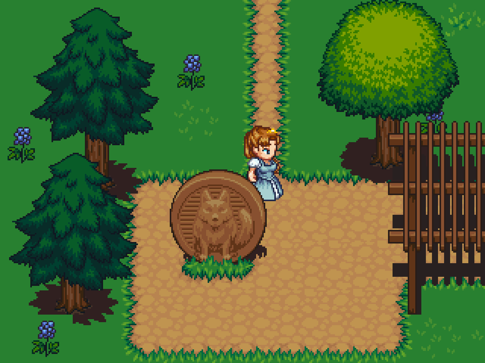

This is an example of "RPG" game using GESTE. The data are generated from
the Tiled map editor using
[tiled-code-gen](https://raw.githubusercontent.com/Fabien-Chouteau/tiled-code-gen).

Art by [Lanea Zimmerman (special thanks: William Thompson)](https://opengameart.org/content/lpc-modified-base-tiles)
