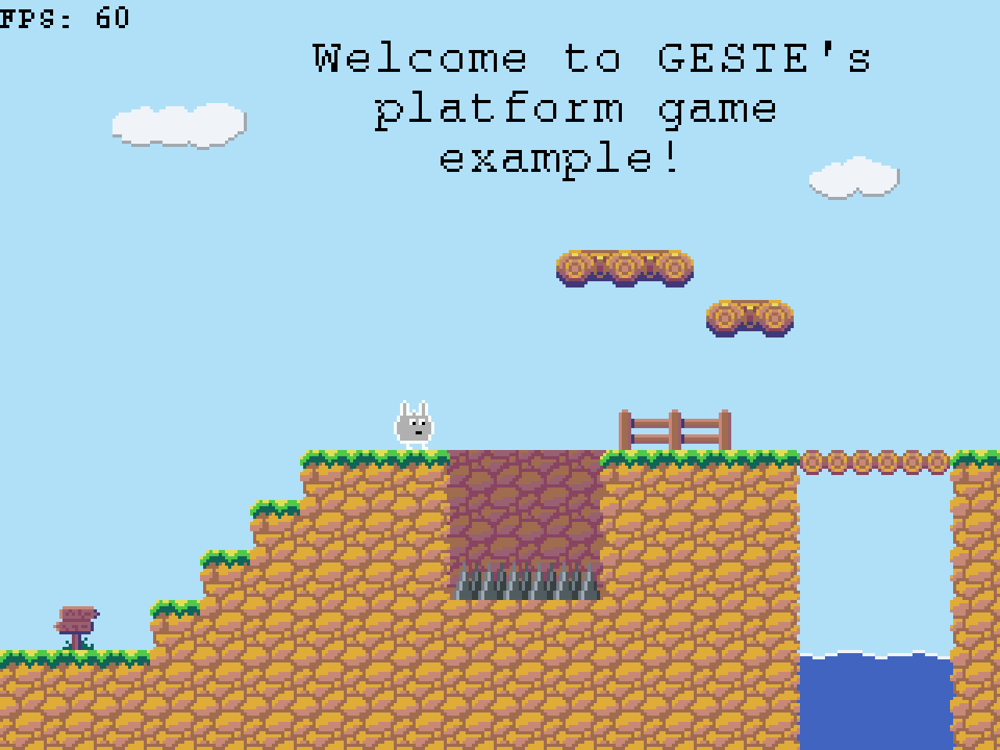

This is an example of platform game using GESTE. The data are generated from
the Tiled map editor using
[tiled-code-gen](https://raw.githubusercontent.com/Fabien-Chouteau/tiled-code-gen).

Art by [FuzzyWuzzie](https://opengameart.org/content/platformer-characters-from-shrunken-adventures).

